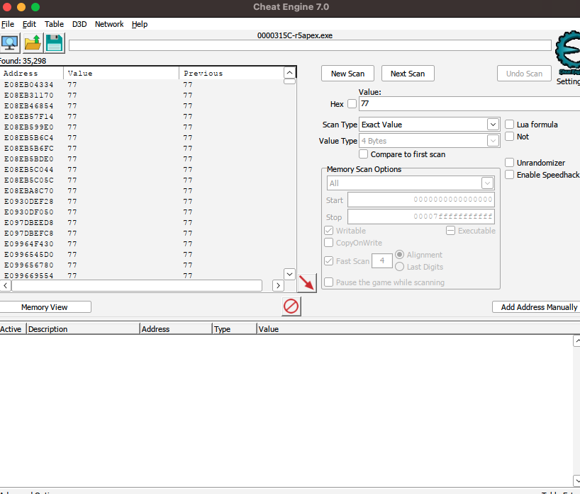

# ceserver-rawmem 

CEServer for **Cheat Engine7.4** to perform DMA access to Windows system processes

The system in the memory dump only supports 64-bit systems, windows10, windows11

### Instructions:

```
CEServer for raw memory dump file, QEMU/KVM
Usage:
  ceserver-rawmem [OPTION...]

  -f, --file arg  Memory dump file name
      --vm arg    QEMU/KVM guest name
  -p, --port arg  CEServer port (default: 8997)
  -h, --help      Show help
```

-f parameter **only supports complete linear physical memory dump**, you can get it through [MemProcFS](https://github.com/ufrisk/MemProcFS)


### Example for kvm core dump

Run commond

``` 
MemProcFS.exe -device win10.core
```

Copy `M:\memory.pmem ` to your workspace

Open WSL and run command 

```
./ceserver-rawmem -f memory.pmem
```

Port forwarding for WSL

```
netsh interface portproxy add v4tov4 listenport=8997 listenaddress=0.0.0.0 connectport=8997 connectaddress=xxx.xxx.xxx.xxx
```

Open Cheat Engine, connect to localhost:8997


### Example for QEMU/KVM

If you have a virtual machine named win10

```
./ceserver-rawmem --vm win10
```

Open Cheat Engine, connect to localhost:8997


### How to build

Environment: Ubuntu22.04 x64

Require:

1. CMake >= 3.2.0
2. Clang >= 14
3. OpenSSL >= 1.1.1
4. Zlib >= 1.2.11
5. Boost >= 1.74
6. Fmt >= 8.1.1

```
sudo apt-get update
sudo apt-get install -y build-essential zlib1g-dev libssl-dev cmake clang-14 libboost-all-dev libfmt-dev
mkdir build
cd build
cmake .. -DCMAKE_C_COMPILER=clang-14 -DCMAKE_CXX_COMPILER=clang++-14
make
```

Environment: macOS 13.4.1

```
brew install cmake
mkdir build
cd build
cmake .. -DCMAKE_C_COMPILER=clang -DCMAKE_CXX_COMPILER=clang++
make
```


### ToDoList

- [ ] Support qemu-kvm, pcileech

- [ ] Write an example of dumping apex game data

- [ ] Make a qemu-kvm cheat


### Screenshots




### Credits

- [memflow](https://github.com/memflow/memflow): Provides a nice way to get the base address of ntoskrnl.exe

- [query-pdb](https://github.com/zouxianyu/query-pdb): Provides a good pdb parsing service

- [cheatengine](https://github.com/cheat-engine/cheat-engine): Cheat Engine is a development environment focused on modding games and applications for personal use.
- [cxxopts](https://github.com/jarro2783/cxxopts): Lightweight C++ command line option parser
- [MemProcFS](https://github.com/ufrisk/MemProcFS): MemProcFS is an easy and convenient way of viewing physical memory as files in a virtual file system.

